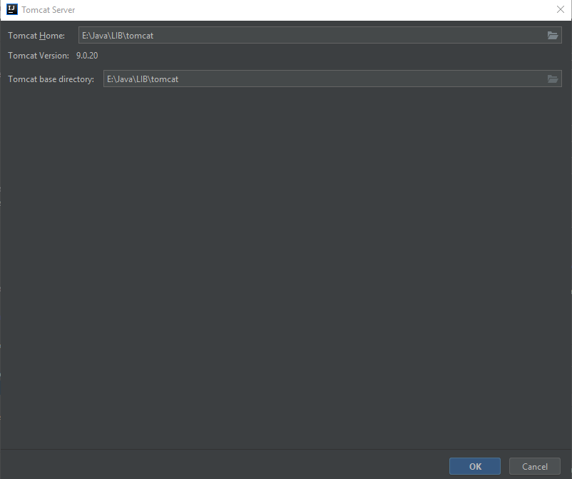

# MGM Experiences


## Build


### Prerequisites

* Maven
* [PostgreSQL](https://www.postgresql.org/) installed locally or on docker (instruction down below)

### Pull git

```
git init
git pull https://bitbucket.mgm-tp.com/scm/exp/main.git
```

### Steps

*    Edit SQL configurations appropriately to your environment ( *.properties* files in *src/main/resources* ):
*    Generate/update tables with Liquibase if necessary:

```
mvn liquibase:update
```

*    Build:

```
mvm clean install
```

## Run/Debug locally

### Prerequisites


* Intellij IDEA Ultimate
* [Tomcat](https://tomcat.apache.org/) downloaded and extracted

### Configuration
* At the top right corner of the IDE, click **Add Configuration**.


* Click the **Plus (+)** and choose **Tomcat Server** > **Local**


* Click **Configure...**


* Set **Tomcat Home** to your extracted tomcat directory then click **OK**.



* Choose **Deployment** tab then click the **Plus (+)** and choose the **mgm-experiences:war**.


* Set **Application context** to decide the pathing of the URL. For example, here we set **'/'** which means ROOT. 


* Adjust any other options as you see fit.

* Click **OK** to finished the configuration.

### Run/Debug


Make sure the drop-down list has been set correctly to the configuration you just created.

Click the button to perform the action accordingly.


## Docker


### [PostgresSQL](https://hub.docker.com/_/postgres)
#### Pull the image

```
 docker pull postgres:{tag}
```

*    **\{tag\}**: [The image tag/version](https://hub.docker.com/_/postgres#supported-tags-and-respective-dockerfile-links). Eg: *latest*, *11*,...

#### Start the container

```
docker run --name {container_name} -p {port}:5432 -d postgres
```

*    **\{container_name\}**: The name for the container you want to create.
*    **\{port\}**: Your local port you wish to use for Postgres.

